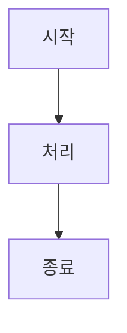

# Obsidian 폴더 구조 설정 가이드

## 📁 완전한 Obsidian 폴더 구조

### 루트 구조

```
Prompt Tracking System/
├── 01_Project/
│   ├── Overview.md                    # 프로젝트 개요
│   ├── Goals & Objectives.md          # 목표 및 요구사항
│   ├── Technical Decisions.md         # 기술 선택 정당성
│   ├── Risks & Mitigation.md          # 위험 관리
│   └── Success Criteria.md            # 성공 지표
│
├── 02_Architecture/
│   ├── System Architecture.md         # 고수준 아키텍처
│   ├── Component Design.md            # 컴포넌트 설계
│   ├── Data Flow.md                   # 데이터 흐름
│   ├── Database Schema.md             # DB 스키마
│   └── API Specification.md           # API 명세
│
├── 03_Development/
│   ├── Setup Guide.md                 # 개발 환경 설정
│   ├── Development Standards.md       # 개발 표준
│   ├── Testing Strategy.md            # 테스트 전략
│   ├── Debugging Tips.md              # 디버깅 팁
│   └── Common Issues.md               # 일반적인 문제
│
├── 04_References/
│   ├── Claude Code.md                 # Claude Code 가이드
│   ├── Rust Ecosystem.md              # Rust 생태계
│   ├── SQLite Guide.md                # SQLite 가이드
│   ├── Dependencies.md                # 의존성 정보
│   ├── External Links.md              # 외부 링크 모음
│   └── Terminology.md                 # 용어 정의
│
└── 05_Progress/
    ├── Timeline & Milestones.md       # 타임라인
    ├── Weekly Updates.md              # 주간 업데이트
    ├── Challenges & Solutions.md      # 과제 및 해결책
    ├── Lessons Learned.md             # 학습 내용
    └── Progress Log.md                # 진행 로그
```

---

## 📋 각 폴더별 상세 설명

### 01_Project 폴더
**목적**: 프로젝트 계획, 목표, 결정사항 관리

**포함 문서**:
1. **Overview.md** (시작점)
   - 프로젝트 소개
   - 핵심 가치 제안
   - 성공 지표
   - 기술 스택 개요

2. **Goals & Objectives.md**
   - SMART 목표
   - 기능 요구사항
   - 비기능 요구사항
   - 사용 사례

3. **Technical Decisions.md**
   - 기술 스택 정당성
   - 대안 비교
   - 의사결정 기록
   - 미래 고려사항

4. **Risks & Mitigation.md**
   - 식별된 위험
   - 우선순위
   - 대응 계획
   - 모니터링 방법

5. **Success Criteria.md**
   - 정량적 지표
   - 정성적 지표
   - 측정 방법
   - 평가 주기

---

### 02_Architecture 폴더
**목적**: 시스템 설계 및 아키텍처 관리

**포함 문서**:
1. **System Architecture.md**
   - 고수준 다이어그램
   - 계층별 구조
   - 컴포넌트 개요
   - 확장성 고려사항

2. **Component Design.md**
   - 각 컴포넌트 상세 설계
   - 인터페이스 정의
   - 책임 범위
   - 의존성 관계

3. **Data Flow.md**
   - 데이터 흐름 다이어그램
   - 각 흐름별 상세 설명
   - 에러 처리 흐름
   - 최적화 포인트

4. **Database Schema.md**
   - SQL DDL
   - 테이블 설명
   - 인덱스 전략
   - 제약사항
   - 마이그레이션 계획

5. **API Specification.md**
   - CLI 커맨드 명세
   - 입출력 형식
   - 에러 코드
   - 사용 예시

---

### 03_Development 폴더
**목적**: 개발 가이드 및 진행 중 필요한 정보

**포함 문서**:
1. **Setup Guide.md**
   - 단계별 설정
   - 도구 설치
   - IDE 구성
   - 초기 프로젝트 생성

2. **Development Standards.md**
   - 코드 스타일
   - 명명 규칙
   - 주석 가이드
   - 에러 처리 패턴

3. **Testing Strategy.md**
   - 테스트 타입
   - 작성 가이드
   - 실행 방법
   - 커버리지 목표

4. **Debugging Tips.md**
   - 로깅 방법
   - 디버거 사용법
   - 프로파일링
   - 성능 분석

5. **Common Issues.md**
   - 자주 마주치는 문제
   - 해결 방법
   - FAQ
   - 트러블슈팅

---

### 04_References 폴더
**목적**: 외부 자료 및 학습 자료 정리

**포함 문서**:
1. **Claude Code.md**
   - API 정리
   - 설정 방법
   - 제한사항
   - 통합 가이드

2. **Rust Ecosystem.md**
   - 추천 라이브러리
   - 각 라이브러리 가이드
   - 버전 정보
   - 호환성 주의사항

3. **SQLite Guide.md**
   - 최적화 팁
   - 인덱싱 전략
   - 성능 튜닝
   - 백업 방법

4. **Dependencies.md**
   - 모든 의존성 나열
   - 버전 정보
   - 라이선스
   - 업데이트 계획

5. **External Links.md**
   - 공식 문서 링크
   - 학습 자료
   - 커뮤니티 리소스
   - 도구 링크

6. **Terminology.md**
   - 프로젝트 용어 정의
   - 약자 설명
   - 개념 정리

---

### 05_Progress 폴더
**목적**: 프로젝트 진행 상황 추적

**포함 문서**:
1. **Timeline & Milestones.md**
   - Phase별 계획
   - 주간 계획
   - 마일스톤
   - 예상 기간

2. **Weekly Updates.md**
   - 주간 진행 현황
   - 완료 작업
   - 예정 작업
   - 문제점

3. **Challenges & Solutions.md**
   - 마주친 문제들
   - 해결 방법
   - 학습 내용
   - 적용한 해결책

4. **Lessons Learned.md**
   - 프로젝트에서 배운 것
   - Best practices
   - 피해야 할 것
   - 향후 개선사항

5. **Progress Log.md**
   - 상세 작업 기록
   - 완료된 항목 체크리스트
   - 시간 추적
   - 통계 정보

---

## 🔗 노트 간 연결 (Backlinks)

### 상호 참조 예시

**Overview.md에서**:
```markdown
관련 문서:
- [[Goals & Objectives]] - 상세 목표
- [[Technical Decisions]] - 기술 선택
- [[System Architecture]] - 아키텍처
```

**Goals & Objectives.md에서**:
```markdown
관련 문서:
- [[Overview]] - 프로젝트 개요로 돌아가기
- [[System Architecture]] - 구현 설계
- [[Database Schema]] - 데이터 설계
```

**System Architecture.md에서**:
```markdown
관련 문서:
- [[Component Design]] - 컴포넌트 상세
- [[Database Schema]] - DB 설계
- [[API Specification]] - API 명세
```

---

## 📌 Obsidian 설정 팁

### 1. 메타데이터 (YAML Frontmatter)

각 노트 상단에 추가:
```yaml
---
tags: [project, architecture]
created: 2025-11-18
last_updated: 2025-11-18
status: draft
relates_to: [Goals & Objectives, System Architecture]
---
```

### 2. 태그 시스템

**프로젝트 태그**:
- `#project` - 프로젝트 전체
- `#goal` - 목표 관련
- `#architecture` - 아키텍처
- `#development` - 개발
- `#progress` - 진행 상황

**상태 태그**:
- `#status/draft` - 초안
- `#status/review` - 검토 중
- `#status/final` - 완성

**우선순위 태그**:
- `#priority/high` - 높음
- `#priority/medium` - 중간
- `#priority/low` - 낮음

### 3. Obsidian 플러그인 추천

**설치 추천**:
1. **Backlinks Panel** - 역링크 보기
2. **Tag Wrangler** - 태그 관리
3. **Dataview** - 데이터베이스 뷰
4. **Calendar** - 날짜별 관리
5. **Templates** - 템플릿 관리

**플러그인 설정**:
```
설정 → 커뮤니티 플러그인 → 찾아보기 → [플러그인명] → 설치
```

### 4. 템플릿 생성

**새 문서 템플릿** (`_templates/Note Template.md`):
```markdown
---
created: {{date:YYYY-MM-DD HH:mm}}
updated: {{date:YYYY-MM-DD HH:mm}}
tags: []
---

# 제목

## 개요

## 주요 내용

## 관련 문서
- [[]]

## 다음 단계
- [ ]

---

마지막 업데이트: {{date:YYYY-MM-DD}}
```

---

## 📊 대시보드 보기 생성

### 메인 대시보드 (Dashboard.md)

```markdown
# 📊 프로젝트 대시보드

## 🎯 현재 상태
- 프로젝트: [[Overview]]
- 진행율: 30%
- 다음 마일스톤: Phase 1 완료 (2025-12-05)

## 📅 이번 주 작업
```dataview
TASK FROM "05_Progress"
WHERE date = today
```

## 📌 우선 순위 항목
```dataview
LIST
FROM "01_Project" OR "02_Architecture" OR "03_Development"
WHERE priority = "high"
SORT priority DESC
```

## 📈 통계
- 총 문서: 15개
- 작성 중: 5개
- 완성: 10개
```

---

## 📝 문서 작성 워크플로우

### Step 1: 문서 생성
```
New Note → 적절한 폴더 선택 → 템플릿 적용
```

### Step 2: 콘텐츠 작성
```
제목 → 개요 → 세부 내용 → 관련 링크 추가
```

### Step 3: 태그 추가
```
적절한 태그 추가 → 상태 태그 설정 → 우선순위 설정
```

### Step 4: 링크 연결
```
관련 문서 링크 → 역링크 확인 → 네비게이션 개선
```

### Step 5: 검토 및 완성
```
내용 검토 → 링크 검증 → 상태를 'final'로 변경
```

---

## 🎯 Obsidian 사용 팁

### 1. 빠른 네비게이션
- `Cmd+K` (macOS) / `Ctrl+K` (Windows): 문서 열기
- `Cmd+O` (macOS) / `Ctrl+O` (Windows): 명령 팔레트
- `Cmd+G` (macOS) / `Ctrl+G` (Windows): 그래프 뷰

### 2. 작업 관리
```markdown
- [ ] 완료할 작업
- [x] 완료된 작업
```

### 3. 코드 블록
````markdown
```rust
fn main() {
    println!("Hello, Rust!");
}
```
````

### 4. 테이블
```markdown
| 항목 | 설명 |
|------|------|
| A    | 설명 |
```

### 5. 다이어그램 (Mermaid)
````markdown

````

---

## 📱 모바일 동기화 (옵션)

### Obsidian Sync 설정
1. 설정 → Sync → 활성화
2. 모든 디바이스에서 설정
3. 클라우드 기반 동기화 (선택사항)

### Git 기반 동기화 (무료)
```bash
# Git 저장소로 설정
git init
git add .
git commit -m "Initial Obsidian vault"
git push
```

---

## ✅ 초기 설정 체크리스트

Obsidian 셋업 완료 체크리스트:

- [ ] Obsidian 설치
- [ ] 폴더 구조 생성
- [ ] 모든 .md 파일 추가
- [ ] 메타데이터 추가
- [ ] 태그 시스템 구성
- [ ] 플러그인 설치
- [ ] 템플릿 생성
- [ ] 대시보드 설정
- [ ] 백링크 확인
- [ ] 그래프 뷰 확인

---

## 📚 참고 자료

- **Obsidian 공식**: https://obsidian.md
- **Obsidian 가이드**: https://help.obsidian.md
- **커뮤니티**: https://forum.obsidian.md
- **Obsidian Hub**: https://publish.obsidian.md/hub

---

마지막 업데이트: 2025-11-18
